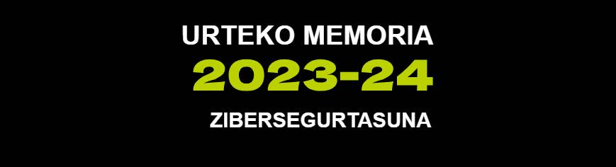

# Zibersegurtasuna 2023-2024
**Tknikako Zibersegurtasun lan taldearen 2023 - 2024 kurtsoko memoria**

## Aurkibidea

1. [Aurkezpena:](#1aurkezpena)
2. [2024ko zifrak:](#22024ko-zifrak)
3. [Lan ildoak:](#3lan-ildoak)
   - 3.1 [Proiektuak:](#31-proiektuak)
      - 3.1.0 Cyber-Lehia
      - 3.1.1 Erd/Def CTF azpiegitura:
      - 3.1.2 Erd/Def CTFrako ariketak (Zerbitzuak):
      - 3.1.3 Erd/Def CTFrako bistaratze sistema:
   - 3.2 [Pilotuak:](#32-pilotuak)
      - 3.2.1 Phishing
      - 3.2.2 Vishing
      - 3.2.3 Hack the box
      - 3.2.4 Pentesting 
   - 3.3 [Ikastaroak:](#33-ikastaroak)
      - 3.3.1 Kontzientziazio kanpañak: Phishing-Vishing
      - 3.3.2 Komunikazio industrial ez seguruei erasotzeko tailer praktikoa
      - 3.3.3 Sare industrialen segmentazio tailer praktikoa
      - 3.3.4 Web Garapen Segurua
      - 3.3.5 "Zibersegurtasuneko araudia irakaslearen ikuspuntutik". Webinar (Ruth Sala)
   - 3.4 [Sortutako edukiak:](#34-sortutako-edukiak)
   - 3.5 Zentruetako proiektuak:
      - 3.5.1 Cyber car
      - 3.5.2 OT Erronkak
4. [Harremanak eta Komunikazioa:](#4harremanak-eta-komunikazioa)
---------------------------------------------------------------------------------------------------------------------------------------------
## 1.Aurkezpena:
2023-24 ikasturtean zehar **Tknikako Zibersegurtasun** lantaldean jorratu diren edukiak agertzen dira jarraian. Edukiak zerrendatzeaz gain, erabilitako fitxategi edo sorturiko materialetara iristeko estekak ere badaude. 

## 2.2024ko zifrak:
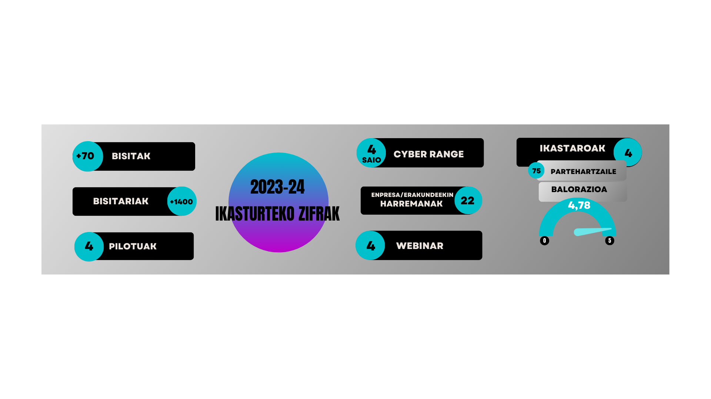  
Aurten 100. ikaslea izan dugu geure CyberRange-an. Ikasle guzti guztiek gomendatzen dute esperientzia. 

## 3.Lan ildoak:
### 3.1 Proiektuak:
#### 3.1.1 Erd/Def CTF azpiegitura:
  - ##### Kokapena

Aurreko ikasturtean CyberRangea kontsolidatu ostean, erasorako edo ikerketarako gaitasunez gain defentsarako eta hutsuneak zuzentzeko gaitasunak ere ekaskatzen dituen CTF plataforma bat martxan jartzeri ekin diogu ikasturte honetan.

Hasteko, mota honetako plataformak dagoeneko existitzen direnez, gurea muntatzeko zeinetan oinarritu behar ginen ebaluatu genuen. Aukera desberdinak ikusi ostean Friedrich-Alexander University Erlangen-Nürnberg (FAU) unibertsitateko segurtasun taldeak (FAUST) burutzen duen mota honetako nazioarteko probarako garatutako plataforman oinarritu gara eta beraien bi proiktu erabili ditugu:

      - Gameserverra: https://github.com/fausecteam/ctf-gameserver
      - Ansible bidezko instalazioa: https://github.com/fausecteam/ctf-gameserver-ansible

  - ##### Lehen hurbilepna: Terraform eta AWS

Gure CTF plataformak bi baldintza betete behar zituela ikusi genuen: lehena, azpiegitura guztia modu zentralizatuan eraikitzea; bigarrena, emamangarria eta erras errepikagarria izatea.

Eramangarritasunari dagokionez, azpiegitura montatzeko IaC (Infraestructure as Code) motako tresnak erabiltzea egokia zela ikusita, **Terraformen** aldeko apustua egin genuen.

Azpiegitura osoa modu zentralizatuan erakitzea esaten dugunean, beharrezko osagai guztiak, baita erabiltzaleek defendatu beharreko makinak ere, CTF plataforma bertan montatuko direla. Jatorrizko sistemak, FAUSTek garatutakoak, eredu desentralizatu bat dauka: erdian Gameserverra bere osagaiekin, beraien azpiegituretan, eta talde bakoitzak berak defendatu beharreko makinak, azpiegitura propioetan. Beraz, moldaketa hau zen gure lehen erronketako bat. Dena leku berean montatzeko aukera hori gauzatzeko orduan alternatiba desberdinak aztertu genituen eta agian altertatiba bat baino gehiagotan inplementatzea egokia izan ahal zela ikusi genuen. 

Bi onarri horiek horrela, lehen aukera Terraform bidez AWSn hedapena egitea izan zen. Hai inplementatu genuen (oraindik zuzenketak behar dituen bertsio batean), baina AWSk bere horretan mugak zituela ikusi genuen. Bereziki objetuak (makinak sareak, sare gailuak...) sortzeko mugak oso azkar aurkitu genituen, eta muga hauek lausotzea eskatu deitekela jakinda ere, ez zen oso aukera praktikoa, eramaten zen leku bakoitzean mugen tratamendu egin beharko baitzen.

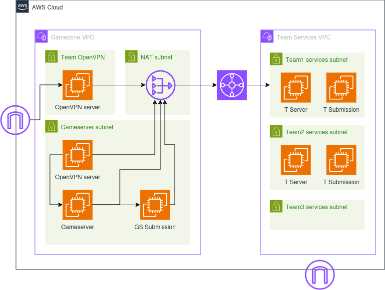

#### 3.1.2 Erd/Def CTFrako ariketak (Zerbitzuak):

Behin azpiegitura erabilgarri genuela, lehen proba batzuk sortu genituen hau probatzeko eta gero azpiegitura CyberLehiako finalean erabiliko genuela erabaki zenean hasierako horiei gehitutakoekin 6 ariketa edo zerbitzu sortu genituen; hona hemen zerbitzu horietako baten azalpentxoa, adibide modura: 
   Zertan datza? ssh zerbitzu bat dugu martxan. Baimenduta dauka erabiltzaile/pasahitza bitartez kautotzea; gainera, erabiltzaile baten pasahitzak ez die gomendio minimoei eusten. 
   Ahuleziaren saikapena: OWASP-i dagokionez, hainbat taldetan multzokatu genezake, baina nagusia A07:2021-Identification and Authentication Failures kontsideratu liteke. 
   Erasoa: hiztegi-eraso bat gauzatu daiteke hydra bezalako tresna bat erabilita; hiztegirik izan ezean, eraso gordina bideratu daiteke. 
   Defentsa: desgaitu egin behar da erabiltzaile/pasahitza bitartez kautotzeko aukera; hori egin ostean, erabiltzaileak kriptografia asimetrikoaren bidez kautotu beharko dira, giltz bat erabilita.

#### 3.1.3 Erd/Def CTFrako bistaratze sistema:

### 3.2 Pilotuak:
#### 3.2.1 Phishing:
 - ##### Kokapena

Phishingaren inguruko kontzientziazio kanpañak landu asmoz, iaz Smartphense tresna testeatu ondoren, aurtengo ikasturtean **Gophish** software librearen pilotu bat jorratu da. Github-etik deskargatu daiteke, <a href="https://github.com/gophish/gophish/releases"> esteka </a> honetatik. Kontzientziazio kanpañaren lehendabiziko fasean, Tknikako instalazioetan egin da lehen lanketa. Bertako langileen epostetara, email desberdinak bidali dira igorle faltsu batetatik, webgune faltsu batetarako estekarekin. Tknikan eginiko lanketaren balorazio positiboa egin ostean, pilotu hau Lanbide Heziketako ikastetxeetara zabaltzea erabaki zen. Ikastetxe desberdinei proposamena egin ondoren, azkenean Zubiri Manteo, Uni Eibar, Izarraitz eta Iurretako ikastetxeetan jorratu zen kanpañaren bigarren fasea. Bertako irakasleen emailetara, mezu desberdinak bidali zirelarik. 
Jarraitutako urratsen **GIDA** beheko dokumentuan klikatuta ikusiko duzue:

 <a href="docs/Gophish_gida.pdf" class="image fit">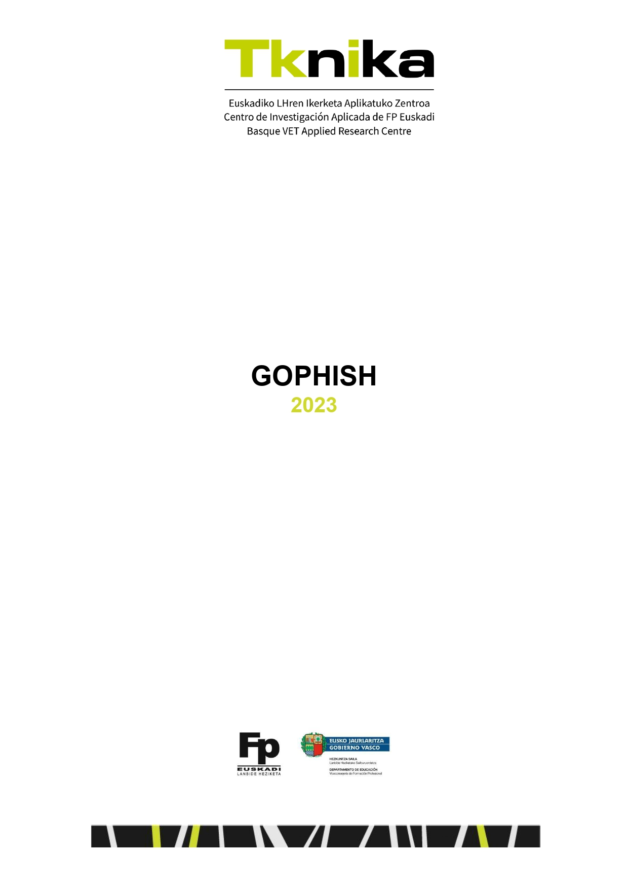</a>

Tknikan jorraturiko pilotuaren exekuzioa azaltzen duen bideo laburra:

<a href="https://youtu.be/WRu7IkI5Jq4"> 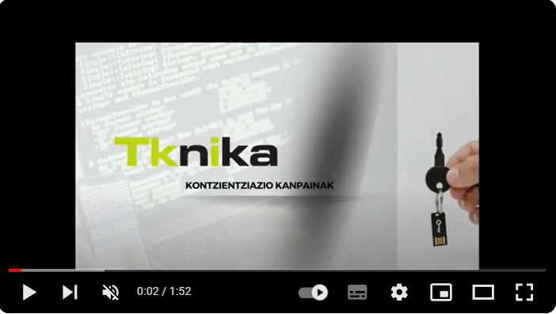 </a>

#### 3.2.2 Vishing:
 - ##### Kokapena
Iaz eta aurten phishing pilotuen lanketan ibili ondoren, VISHING kanpaña bat burutu da Tknikako instalazioetan eraso mota hauek izan dezaketen inpaktua lankideen artean jorratzeko. Dei telefoniko bidez eginiko kontzientziazio kanpaña bat izan da, eta beronen bueltan erabili diren teknikak eta tresnak gertuagotik ezagutzeko lagundu digu.
Kanpaña hau, BeDisruptive enpresari eskatu zaio eta jarraian duzuen dokumentuan aurkituko dituzue kanpaña honen inguruko xehetasunak:

 <a href="docs/TKNIKA_VISHING_github.pdf" class="image fit">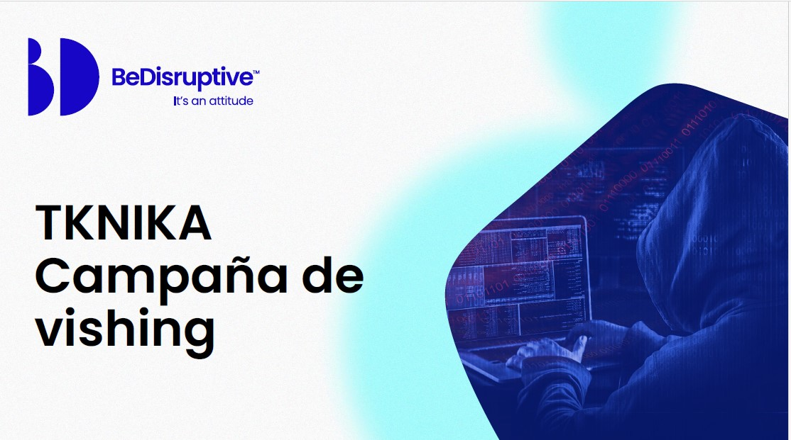</a>

#### 3.2.3 Hack the box:

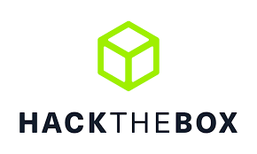

 - ##### Kokapena
Hack The Box plataforma, Lanbide Heziketako Zibersegurtasun espezialitatean erabiltzearen ikuspegitik, Txurdinagako LH ikastetxean ikasturte osoan frogatu den tresna bat izan da. HTB-ek eskeintzen dituen laborategi desberdinak frogatu eta ikasleekin lan egiteko orduan ematen dituen abantailak testeatu dira. Horrez gain, ikasturte honetan CyberLehian, etab ere erabili da eta bertatik jasotako esperinetzia eta ateratako ondorioak partekatu, hausnartu eta beste aukera posibleei buruz lanketa egin asmoz, jardunaldi bat antolatzea izan da helburua. Jardunaldi honetan, ondorioak partekatzeaz gain, HTB-ko erronka bat elkarlanean landu da.

#### 3.2.4 Pentesting Pilotua Iurreta LHI:

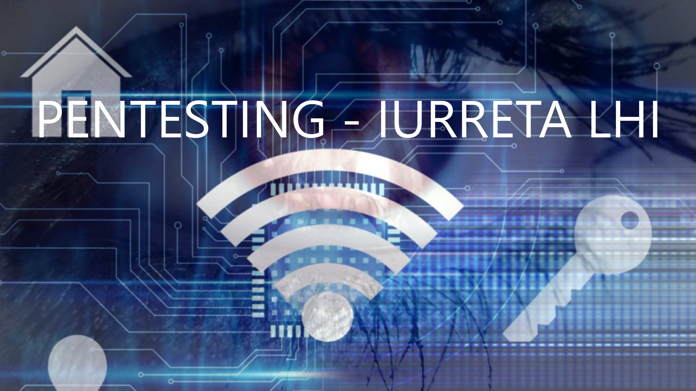

 - ##### Kokapena
Tknikako zibersegurtasun alorretik Pentesting-eko pilotu bat jarri da martxan bigarren urtez jarraian. Pilotu honetan, zibersegurtasunaren espezializazioa egin duen ikasle batek, sektoreko enpresa baten laguntzarekin (JakinCode), zentro baten (Iurreta LHI) segurtasun auditoretza egiten du.   

Iurreta LHI zentroan eginiko lana partekatu asmoz, Webinar bat egin da Ekainean. Webinarraren helburua lortutako emaitzak aurkeztea eta esperientzia prozesuan interesa dutenekin partekatzea izan da.

### 3.3 Ikastaroak:
#### 3.3.1 Kontzientziazio kanpañak: Phishing-Vishing

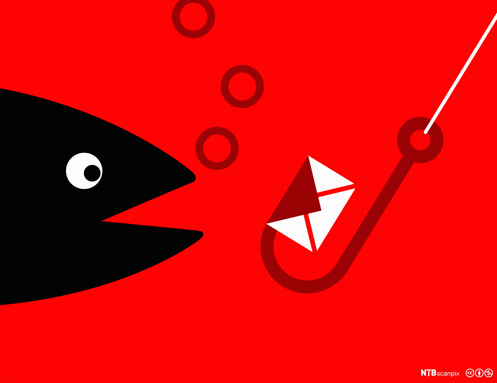

Tknikan landuriko pilotuen ildoa jarraituz, bertan bilduriko esperientzia partekatu asmoz, ikastaro bat eman da Phishing/Vishing tekniken kontzientziazioa landuz. Kontzientziazio kanpañak burutzeko metodologiak eta tresnak landu dira bertan. Kontzientziazio kanpañak burutzeko urratsetan sakondu da: 
 - 1.Informazioa topatu (OSINT)
 - 2.Eszenatokiak sortu (SMTP zerbitzariak, GOPHISH ingurunea)
 - 3.Kanpañak diseinatu.
 - 4.Vishing nola?

Ikastaroan erabilitako materiala, Githubek errepositorio honetan duzue ikusgai.
[Dokumentazio Gida](KONTZIENTZIAZIOA)
#### 3.3.2 Komunikazio industrial ez seguruei erasotzeko tailer praktikoa
<a href="https://drive.google.com/drive/folders/1RZYG0BOWVfZFVcp6iwW28reY7XXHdKKw"> Edukiak </a>

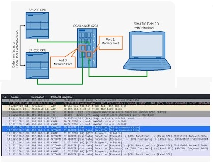

Lantegi praktiko honetan, industria-sistemak komunikazio ez-seguruen eta izan dezaketen arriskuen ikuspegitik aztertu dira. Sareko ekipoak ezagutzeko tresnak erabili dira (Nmap), komunikazioetan sortzen den trafikoa aztertu da (Wireshark) eta PLC sistemak "erasotzeko" hainbat teknika erabili dira. 22/23 ikasturtean, industria-kontroleko sistemetan zibersegurtasuna kontuan izateko ikastaroa eman zen. Bertan, sistema industrialak konfiguratzeko orduan zibersegurtasunaren ikuspegitik kontuan hartu beharreko atalak jorratu ziren. Sarrerako prestakuntzaren osagarri gisa, tailer praktiko batzuk planteatu dira, ikastaro horretan ikusitako hainbat atal modu praktikoan lantzeko. Lehen tailerrean industria-komunikazioen gabeziak eta seguruak ez diren industria-sistemetan gerta daitezkeen erasoak aztertu dira.Partaide kopurua: 14 irakasle.

#### 3.3.3 Sare industrialen segmentazio tailer praktikoa
<a href="https://drive.google.com/drive/folders/12DOwM5J-GNARspU_LaM2hmHa2buSFuWq"> Edukiak </a>

Lantegi praktiko honetan sare industrialak segmentatuta izatearen garrantzia aztertuko da. Segmentazio egoki bati esker, ekoizpen-sarean eragina izan dezaketen eta zabaldu ez daitezkeen segurtasun-intzidenteak arindu ditzakegu. Era berean, IEC 62443 segurtasun-araudiak IT/OT sareak bereizita izatera behartzen du. Siemens familiako gailuak, Scalance 615 suhesiak eta Switch 208,408 gailuak erabiliko dira konfigurazioak egiteko. 23/24 ikasturtean, industria-kontroleko sistemetan zibersegurtasuna kontuan izateko ikastaroa eman zen. Bertan, sistema industrialak konfiguratzeko orduan zibersegurtasunaren ikuspegitik kontuan hartu beharreko atalak jorratu ziren. Sarrerako prestakuntzaren osagarri gisa, tailer praktiko batzuk planteatuko dira, ikastaro horretan ikusitako hainbat atal modu praktikoan lantzeko.Partaide kopurua: 16 irakasle.

#### 3.3.4 Web Garapen Segurua

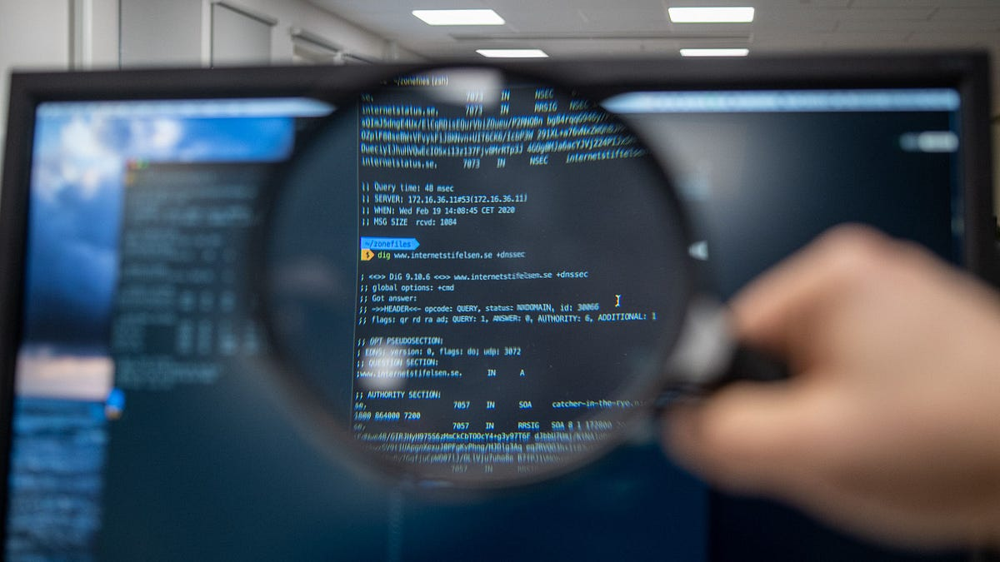

Prestakuntza honen helburua, segurtasuna web garapenaren bizi-zikloaren parte izan dadin, beharrezkoa den ezagutza zabaltzea izan da. Segurtasuna oso espazio zabaleko gaia den arren, prestakuntza honetan web inguruneetan (aplikazioak eta APIak) ematen diren ahulgune ohikoenetan enfokatuko gara. Aipatutako ahulguneak ekiditeko jarraitu beharreko praktika onak ezagutzera eman dira.
Prestakuntza honetan, web-inguruneetan modu seguruan garatzeko kontuan hartu beharreko alderdiak aztertu dira. Horretarako, OWASP erakundeak jasotako ahultasunen top 10ean oinarritu da. OWASP (Open Web Application Security Project) irabazi asmorik gabeko erakunde bat da, eta bere helburua softwarearen segurtasuna hobetzean datza.
“Juice Shop” open source aplikazioa erabili da ikasitakoa praktikan jartzeko. Aplikazio hau segurtasun arazoez beteta dago eta gamifikazio osagai bat du. Ahuleziak ustiatzen diren heinean, lorpenak desblokeatzen dira eta parte-hartzaileak sailkatzen dituen ranking bat sortzen da. Ahuleziak aurkitu ahala, erlazionatutako kodea aztertuko da eta funtzionalitatea modu seguruan garatzeko jarraitu beharreko irizpideak azaltzen dira.

#### 3.3.5 "Zibersegurtasuneko araudia irakaslearen ikuspuntutik". Webinar (Ruth Sala)
Irakaslearen ikuspuntutik Zibersegurtasun Araudiari buruzko webinarra burutu da. Webinar hau <a href="https://www.linkedin.com/in/ruthsala/?originalSubdomain=es">Ruth Sala</a> abokatuak eta gaian adituak eman du, eta bertan zibersegurtasunaren atalean burutzen diren hainbat praktiken legalitatearen inguruan egon daitezkeen galderak erantzun zituen bertan.

<a href="https://www.youtube.com/live/JUFNl8AUOO0"> 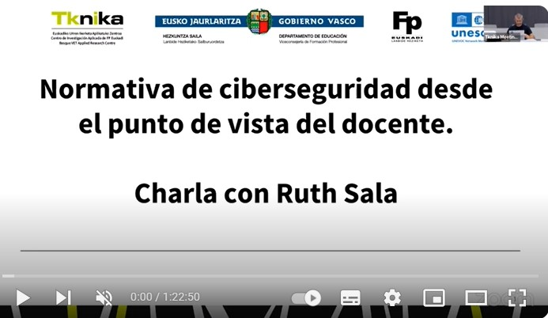 </a>

###  3.4 [Sortutako edukiak:]

###  3.5 Zentruetako proiektuak:
#### 3.5.1 Cyber car
#### 3.5.2 OT Erronkak
## 4. [Harremanak eta Komunikazioa:]
