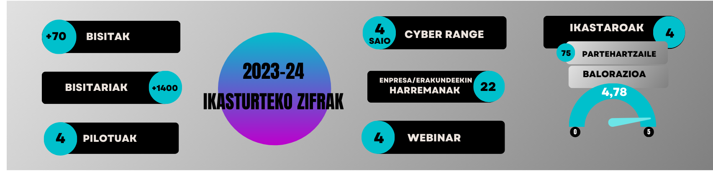

 

# Zibersegurtasuna 2023-2024
**Tknikako Zibersegurtasun lan taldearen 2023 - 2024 kurtsoko memoria** (go to [ENGLISH Version](https://github.com/Tknika/Zibersegurtasuna2023-2024/blob/main/README_en.md). Aurreko ikasturteko memoria ikusi nahi izanez gero (2022-2023) [hemen](https://github.com/Tknika/Zibersegurtasuna2022-2023) aurkitu dezakezu.

## Aurkibidea

- [Zibersegurtasuna 2023-2024](#zibersegurtasuna-2023-2024)
  - [Aurkibidea](#aurkibidea)
  - [1.Aurkezpena:](#1aurkezpena)
    - [1.1 Lan Taldea:](#11-lan-taldea)
  - [2.2024ko zifrak:](#22024ko-zifrak)
  - [3.Lan ildoak:](#3lan-ildoak)
    - [3.1 Proiektuak:](#31-proiektuak)
      - [3.1.0 Er/Def CTF-a:](#310-erdef-ctf-a)
      - [3.1.1 Er/Def CTF azpiegitura:](#311-erdef-ctf-azpiegitura)
      - [3.1.2 Er/Def CTFrako ariketak (Zerbitzuak):](#312-erdef-ctfrako-ariketak-zerbitzuak)
      - [3.1.3 Er/Def CTFrako bistaratze sistemak:](#313-erdef-ctfrako-bistaratze-sistemak)
        - [3.1.3.1 Markagailua](#3131-markagailua)
        - [3.1.3.2 Argiztapena](#3132-argiztapena)
    - [3.2 Pilotuak:](#32-pilotuak)
      - [3.2.1 Phishing:](#321-phishing)
      - [3.2.2 Vishing:](#322-vishing)
      - [3.2.3 Hack the box:](#323-hack-the-box)
      - [3.2.4 Pentesting Pilotua Iurreta LHI:](#324-pentesting-pilotua-iurreta-lhi)
    - [3.3 Ikastaroak:](#33-ikastaroak)
      - [3.3.1 Kontzientziazio kanpañak: Phishing-Vishing](#331-kontzientziazio-kanpañak-phishing-vishing)
      - [3.3.2 Komunikazio industrial ez seguruei erasotzeko tailer praktikoa](#332-komunikazio-industrial-ez-seguruei-erasotzeko-tailer-praktikoa)
      - [3.3.3 Sare industrialen segmentazio tailer praktikoa](#333-sare-industrialen-segmentazio-tailer-praktikoa)
      - [3.3.4 Web Garapen Segurua](#334-web-garapen-segurua)
      - [3.3.5 "Zibersegurtasuneko araudia irakaslearen ikuspuntutik". Webinar (Ruth Sala)](#335-zibersegurtasuneko-araudia-irakaslearen-ikuspuntutik-webinar-ruth-sala)
    - [3.4 Zentruetako proiektuak:](#34-zentruetako-proiektuak)
      - [3.4.1 Cyber car](#341-cyber-car)
      - [3.4.2 OT Erronkak](#342-ot-erronkak)
  - [4.Harremanak eta Komunikazioa:](#4harremanak-eta-komunikazioa)
      - [4.1 Ikasenpresa / Ekintzailetza Jardunaldiak:](#41-ikasenpresa--ekintzailetza-jardunaldiak)
---------------------------------------------------------------------------------------------------------------------------------------------
## 1.Aurkezpena:
2023-24 ikasturtean zehar **Tknikako Zibersegurtasun** lantaldean jorratu diren edukiak agertzen dira jarraian. Edukiak zerrendatzeaz gain, erabilitako fitxategi edo sorturiko materialetara iristeko estekak ere badaude. 
### 1.1 Lan Taldea:
Kurtso honetan lan taldea osatu duten partaideak izan dira:

   - Garikoitz Etxeberria 
   - Paulino Insausti
   - Urko Zuñiga
   - Xabat Zabala
   - Ibai Peña

## 2.2024ko zifrak:
  
Aurten 100. ikaslea izan dugu geure CyberRange-an. Saioan partehartu ondoren pasatzen diegun inkestan diotenez, ikasle guzti guztiek gomendatzen dute esperientzia. 

## 3.Lan ildoak:
### 3.1 Proiektuak:
#### 3.1.0 Er/Def CTF-a:
  - ##### Kokapena

Aurreko ikasturtean CyberRangea kontsolidatu ondoren, erasorako edo ikerketarako gaitasunez gain, defentsarako eta hutsuneak zuzentzeko gaitasunak ere eskatzen dituen CTF plataforma bat martxan jartzeari ekin diogu ikasturte honetan. CyberRangea orain arte Jeopardy motako CTF-a izan da, eta aurten [eraso/defentsa CTF](https://2022.faustctf.net/information/attackdefense-for-beginners/) mota menperatu eta erabiltzeko gaitasuna lortzea zen helburua.

Mota honetako plataformak dagoeneko existitzen direnez, lehenik State-of-the-art nolakoa zen begiratu dugu. Garatutako opensource aukera anitz zeudela ikustean, horietan oinarritzea egoki ikusi dugu, zehazki [Friedrich-Alexander University Erlangen-Nürnberg (FAU)](https://www.fau.eu/) unibertsitateko segurtasun taldearen ([FAUST](https://faust.cs.fau.de/)) bi garapenetan. Bi garapen hauek urtero erabiliak dira Unibertsitateak burutzen duen ER/DEF nazioarteko proban.

Garapen hauei eraldaketa eta gehikuntzak egin dizkiogu guk behar genuenera hurbiltzeko. Gure garapenaren lehen bertsioa honela errepresentatu daiteke:

Azpiegitura hau <a href="https://cyberlehia.fpeuskadi.eus/"> Cyberlehia 2024</a>-n erabili da, Euskadiko Lanbide Heziketarako lehen zibersegurtasun txapelketan, finaleko jardunaldian, txapelketako talde irabazlea erabakitzeko.

Hemen txapelketaren laburpen bideoa.

#### 3.1.1 Er/Def CTF azpiegitura:
  - ##### Kokapena

FAUST Taldearen erabilitako bi proiektuak hauek dira: [CTF Gameserver](https://github.com/fausecteam/ctf-gameserver) (garapenaren oinarria) eta [CTF Gameserver Ansible deployment](https://github.com/fausecteam/ctf-gameserver-ansible) (Ansible bidez plataforma horren hedapena egiteko IaC kodea)

Lan horietatik abiatuta, moldaketa garrantzitsuak egin behar izan dira, guk behar genuen eredua gauzatzeko, taldeen azpigitura osoa plataforman bertan gehitzea besteak beste. Terraform bidez Proxmoxen (AWS bertsio ere bidean) hedatzen den ER/DEF CTF plataforma izan da emaitza. Bi repositoriotan jaso dugu lan hau: [ctf-gameserver-terrraform](https://github.com/Tknika/ctf-gameserver-terraform), muntaia nagusia jasotzen duena; eta [ctf-gameserver-mqtt](https://github.com/Tknika/ctf-gameserver-mqtt), mqtt brokerraren osagaia gehitzen diona.

#### 3.1.2 Er/Def CTFrako ariketak (Zerbitzuak):

Behin azpiegitura erabilgarri genuela, 6 ariketa edo zerbitzu sortu genituen; hona hemen zerbitzu horietako baten azalpentxoa, adibide modura: 
   - Zertan datza? ssh zerbitzu bat dugu martxan. Baimenduta dauka erabiltzaile/pasahitza bitartez kautotzea; gainera, erabiltzaile baten pasahitzak ez die gomendio minimoei eusten. 
   - Ahuleziaren saikapena: [OWASP](https://owasp.org/www-project-top-ten/)i dagokionez, hainbat taldetan multzokatu genezake, baina nagusia A07:2021-Identification and Authentication Failures kontsideratu liteke. 
   - Erasoa: hiztegi-eraso bat gauzatu daiteke hydra bezalako tresna bat erabilita; hiztegirik izan ezean, eraso gordina bideratu daiteke. 
   - Defentsa: desgaitu egin behar da erabiltzaile/pasahitza bitartez kautotzeko aukera; hori egin ostean, erabiltzaileak kriptografia asimetrikoaren bidez kautotu beharko dira, giltz bat erabilita.

#### 3.1.3 Er/Def CTFrako bistaratze sistemak:

MQTT brokerrera iritsitako gertaerak irakurri eta hauen bitartez gertatzen ari dena modu erakargarri batean erakustea da bistaratze sistemen helburua. Modu honetako 2 garapen burutu dira:

##### 3.1.3.1 Markagailua

   GameServerrak badu markagailu bat, baina informazio gehiegi ematen du modu konplexu batean. Garapen berri honen bitartez, automatikoki eguneratzen den markagailu sinple eta erakargarria lortu nahi izan da, eraso ezberdinei buruzko momentuko informazioa ere ematen duena.
   
   

##### 3.1.3.2 Argiztapena

   Ikusgarritasuna handitu asmoz, led argiz osatutako sistema bat jarri da martxan, talde bakoitzarentzat 2 argi dituelarik. CTF-an gertaturiko egoera ezberdinen aurrean modu ezberdinean jokatuko dute argiek. Saioa hastean eta amaitzean, argi guztiek kolorezko patroi bat egingo dute. Eraso bat dagoenean, talde erasotzailearen argiek kolore berdea hartuko dute, talde erasotuarenek aldiz, gorria. 
   
   

### 3.2 Pilotuak:
#### 3.2.1 Phishing:
 - ##### Kokapena

Phishingaren inguruko kontzientziazio kanpañak landu asmoz, iaz Smartphense tresna testeatu ondoren, aurtengo ikasturtean **Gophish** software librearen pilotu bat jorratu da. Github-etik deskargatu daiteke, <a href="https://github.com/gophish/gophish/releases"> esteka </a> honetatik. Kontzientziazio kanpañaren lehendabiziko fasean, Tknikako instalazioetan egin da lehen lanketa. Bertako langileen epostetara, email desberdinak bidali dira igorle faltsu batetatik, webgune faltsu batetarako estekarekin. Tknikan eginiko lanketaren balorazio positiboa egin ostean, pilotu hau Lanbide Heziketako ikastetxeetara zabaltzea erabaki zen. Ikastetxe desberdinei proposamena egin ondoren, azkenean **[Zubiri Manteo BHI](https://zubirimanteo.hezkuntza.net/eu/), [Uni Eibar-Ermua LHII](https://www.uni.eus/eu/), [Izarraitz LHII](https://www.izarraitz.eus)** eta **[Iurretako LHII](https://www.iurretalhi.eus/)** ikastetxeetan jorratu zen kanpañaren bigarren fasea. Bertako irakasleen emailetara, mezu desberdinak bidali zirelarik. 
Jarraitutako urratsen **GIDA** beheko dokumentuan klikatuta ikusiko duzue:

 

Tknikan jorraturiko pilotuaren exekuzioa azaltzen duen **bideo** laburra:

#### 3.2.2 Vishing:
 - ##### Kokapena
Iaz eta aurten phishing pilotuen lanketan ibili ondoren, **VISHING** kanpaña bat burutu da Tknikako instalazioetan eraso mota hauek izan dezaketen inpaktua lankideen artean jorratzeko. Dei telefoniko bidez eginiko kontzientziazio kanpaña bat izan da, eta beronen bueltan erabili diren teknikak eta tresnak gertuagotik ezagutzeko lagundu digu.
Kanpaña hau, <a href="https://www.bedisruptive.com/"> BeDisruptive </a> enpresari eskatu zaio eta [Nacho Brihuega](https://www.linkedin.com/in/ignacio-brihuega-rodr%C3%ADguez-b89564a6/)rekin elkarlanean burutu da. Jarraian duzuen dokumentuan aurkituko dituzue kanpaña honen inguruko xehetasunak:

 

#### 3.2.3 Hack the box:

 - ##### Kokapena
**[Hack The Box](https://www.hackthebox.com/)** plataforma, Lanbide Heziketako Zibersegurtasun espezialitatean erabiltzearen ikuspegitik, **[Txurdinagako LHII](https://fptxurdinaga.eus/eu/)** ikastetxean ikasturte osoan frogatu den tresna bat izan da. HTB-ek eskeintzen dituen laborategi desberdinak frogatu eta ikasleekin lan egiteko orduan ematen dituen abantailak testeatu dira. Horrez gain, ikasturte honetan <a href="https://cyberlehia.fpeuskadi.eus/">**CyberLehian**</a>, etab ere erabili da eta bertatik jasotako esperientzia eta ateratako ondorioak partekatu, hausnartu eta beste aukera posibleei buruz lanketa egin asmoz, jardunaldi bat antolatzea izan da helburua. Jardunaldi honetan, ondorioak partekatzeaz gain, HTB-ko erronka bat elkarlanean landu da.

#### 3.2.4 Pentesting Pilotua Iurreta LHI:

 - ##### Kokapena
Tknikako zibersegurtasun alorretik Pentesting-eko pilotu bat jarri da martxan bigarren urtez jarraian. Pilotu honetan, zibersegurtasunaren espezializazioa [Maristak Durango](https://maristak.com/eu/) egin duen ikasle batek, sektoreko enpresa baten laguntzarekin ([JakinCode](https://jakincode.com/eu/)), zentro baten ([Iurreta LHII](https://www.iurretalhi.eus/)) segurtasun auditoretza egiten du.   

Iurreta LHI zentroan eginiko lana partekatu asmoz, Webinar bat egin da Ekainean. Webinarraren helburua lortutako emaitzak aurkeztea eta esperientzia prozesuan interesa dutenekin partekatzea izan da.

### 3.3 Ikastaroak:
#### 3.3.1 Kontzientziazio kanpañak: Phishing-Vishing

Tknikan landuriko pilotuen ildoa jarraituz, bertan bilduriko esperientzia partekatu asmoz, ikastaro bat eman da **Phishing/Vishing** tekniken kontzientziazioa landuz. Kontzientziazio kanpañak burutzeko metodologiak eta tresnak landu dira bertan. Kontzientziazio kanpañak burutzeko urratsetan sakondu da: 
 - 1.Informazioa topatu (**OSINT**)
 - 2.Eszenatokiak sortu (**SMTP zerbitzariak, GOPHISH ingurunea**)
 - 3.**Kanpañak** diseinatu.
 - 4.**Vishing** nola?

Ikastaroan erabilitako materiala, Githubek errepositorio honetan duzue ikusgai.
[Dokumentazio Gida](KONTZIENTZIAZIOA)
#### 3.3.2 Komunikazio industrial ez seguruei erasotzeko tailer praktikoa
<a href="https://drive.google.com/drive/folders/1RZYG0BOWVfZFVcp6iwW28reY7XXHdKKw"> Edukiak </a>

Lantegi praktiko honetan, industria-sistemak komunikazio ez-seguruen eta izan dezaketen arriskuen ikuspegitik aztertu dira. Sareko ekipoak ezagutzeko tresnak erabili dira (Nmap), komunikazioetan sortzen den trafikoa aztertu da (Wireshark) eta PLC sistemak "erasotzeko" hainbat teknika erabili dira. 22/23 ikasturtean, industria-kontroleko sistemetan zibersegurtasuna kontuan izateko ikastaroa eman zen. Bertan, sistema industrialak konfiguratzeko orduan zibersegurtasunaren ikuspegitik kontuan hartu beharreko atalak jorratu ziren. Sarrerako prestakuntzaren osagarri gisa, tailer praktiko batzuk planteatu dira, ikastaro horretan ikusitako hainbat atal modu praktikoan lantzeko. Lehen tailerrean industria-komunikazioen gabeziak eta seguruak ez diren industria-sistemetan gerta daitezkeen erasoak aztertu dira.Partaide kopurua: 14 irakasle.

#### 3.3.3 Sare industrialen segmentazio tailer praktikoa
<a href="https://drive.google.com/drive/folders/12DOwM5J-GNARspU_LaM2hmHa2buSFuWq"> Edukiak </a>

Lantegi praktiko honetan sare industrialak segmentatuta izatearen garrantzia aztertuko da. Segmentazio egoki bati esker, ekoizpen-sarean eragina izan dezaketen eta zabaldu ez daitezkeen segurtasun-intzidenteak arindu ditzakegu. Era berean, IEC 62443 segurtasun-araudiak IT/OT sareak bereizita izatera behartzen du. Siemens familiako gailuak, Scalance 615 suhesiak eta Switch 208,408 gailuak erabiliko dira konfigurazioak egiteko. 23/24 ikasturtean, industria-kontroleko sistemetan zibersegurtasuna kontuan izateko ikastaroa eman zen. Bertan, sistema industrialak konfiguratzeko orduan zibersegurtasunaren ikuspegitik kontuan hartu beharreko atalak jorratu ziren. Sarrerako prestakuntzaren osagarri gisa, tailer praktiko batzuk planteatuko dira, ikastaro horretan ikusitako hainbat atal modu praktikoan lantzeko.Partaide kopurua: 16 irakasle.

#### 3.3.4 Web Garapen Segurua

Prestakuntza honen helburua, segurtasuna web garapenaren bizi-zikloaren parte izan dadin, beharrezkoa den ezagutza zabaltzea izan da. Segurtasuna oso espazio zabaleko gaia den arren, prestakuntza honetan web inguruneetan (aplikazioak eta APIak) ematen diren ahulgune ohikoenetan enfokatuko gara. Aipatutako ahulguneak ekiditeko jarraitu beharreko praktika onak ezagutzera eman dira.
Prestakuntza honetan, web-inguruneetan modu seguruan garatzeko kontuan hartu beharreko alderdiak aztertu dira. Horretarako, OWASP erakundeak jasotako ahultasunen top 10ean oinarritu da. [OWASP (Open Web Application Security Project)](https://owasp.org/) irabazi asmorik gabeko erakunde bat da, eta bere helburua softwarearen segurtasuna hobetzean datza.
“Juice Shop” open source aplikazioa erabili da ikasitakoa praktikan jartzeko. Aplikazio hau segurtasun arazoez beteta dago eta gamifikazio osagai bat du. Ahuleziak ustiatzen diren heinean, lorpenak desblokeatzen dira eta parte-hartzaileak sailkatzen dituen ranking bat sortzen da. Ahuleziak aurkitu ahala, erlazionatutako kodea aztertuko da eta funtzionalitatea modu seguruan garatzeko jarraitu beharreko irizpideak azaltzen dira.

 

 

Hona hemen formakuntzako bideoak:

Web Garapen Seguru Tailerra 1.1

Web Garapen Seguru Tailerra 1.2 

Web Garapen Seguru Tailerra 2.1

Web Garapen Seguru Tailerra 2.2

#### 3.3.5 "Zibersegurtasuneko araudia irakaslearen ikuspuntutik". Webinar (Ruth Sala)
Irakaslearen ikuspuntutik Zibersegurtasun Araudiari buruzko webinarra burutu da. Webinar hau <a href="https://www.linkedin.com/in/ruthsala/?originalSubdomain=es">Ruth Sala</a> abokatuak eta gaian adituak eman du, eta bertan zibersegurtasunaren atalean burutzen diren hainbat praktiken legalitatearen inguruan egon daitezkeen galderak erantzun zituen bertan.

Galdera/erantzunak lantzen dituen <a href="docs/Normativa de ciberseguridad desde el punto de vista del docente - Ruth Sala.pdf" class="image fit">dokumentua deskargatu dezakezu HEMEN.</a>
 
###  3.4 Zentruetako proiektuak:
#### 3.4.1 Cyber car
#### 3.4.2 OT Erronkak
## 4.Harremanak eta Komunikazioa:
#### 4.1 Ikasenpresa / Ekintzailetza Jardunaldiak:

[Ikasenpresako](https://ekingune.tknika.eus/program/ikasenpresa/) 3 ekitaldietan hitzaldiak eman ditugu ekintzaile gazteei beraien enpresetan erabil zitzaketen zibersegurtasun aholkuak emateko asmoz. Hona hemen erabilitako aurkezpena.

 

