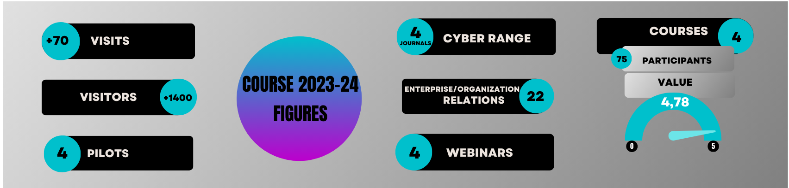
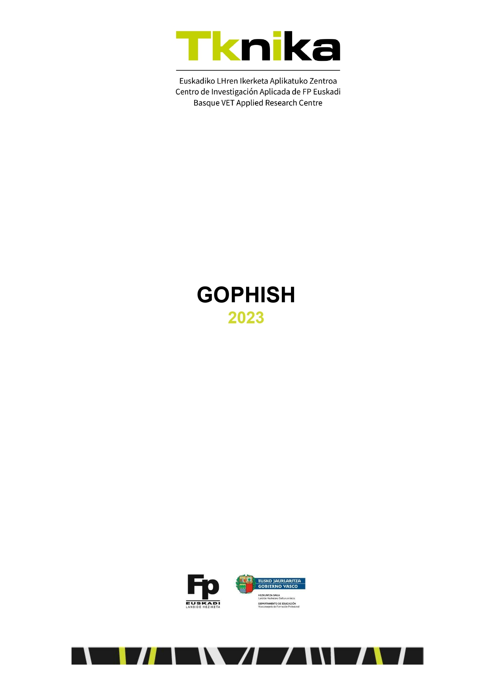
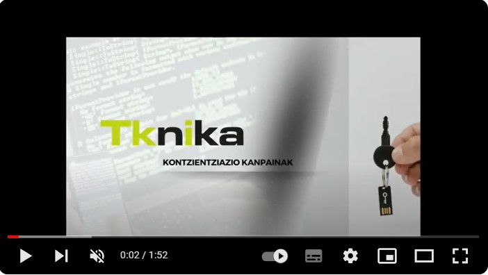
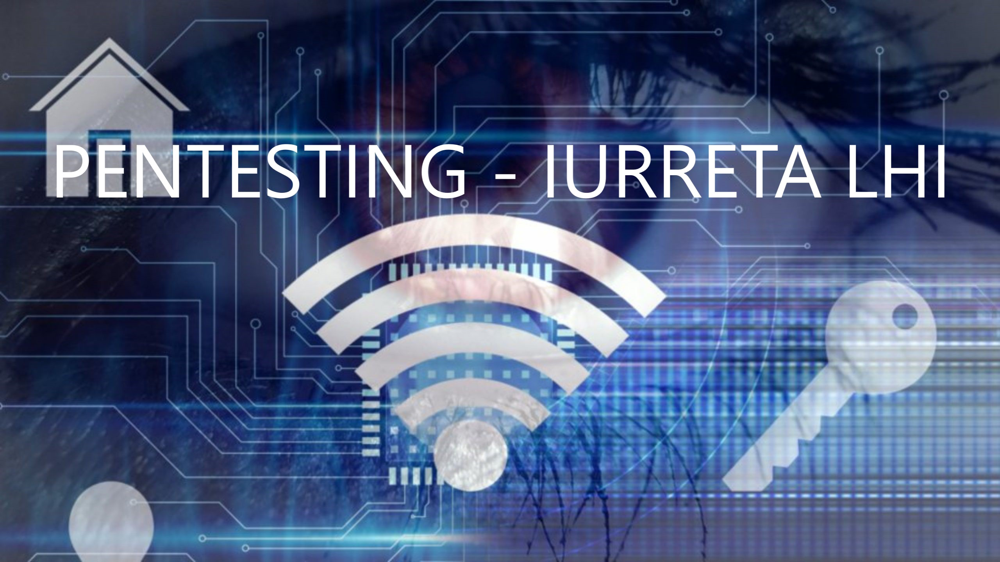
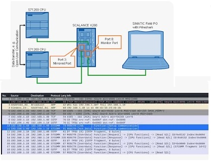
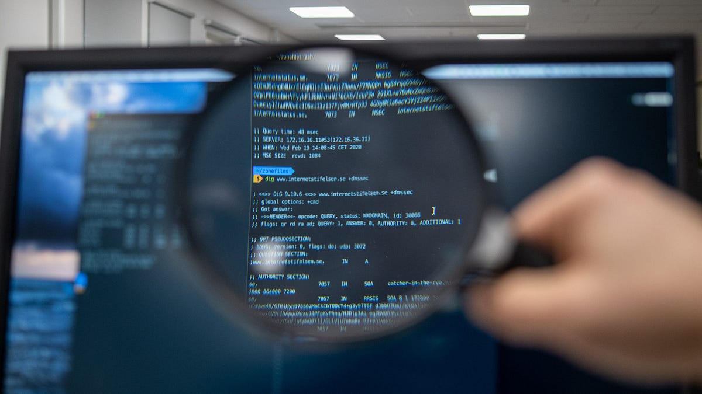

# Cybersecurity 2023-2024
**Memory of the 2023 – 2024 course of the Tknika Cybersecurity Team**

## Index

1. [Introduction:](#1-introduction)
   - 1.1 [Team:](#11-team)
2. [2024 figures:](#22024-figures)
3. [Lines of work:](#3lines-of-work)
   - 3.1 [Projects:](#31-projects)
      - 3.1.0 [Atk/Def CTF:](#310-atkdef-ctf)
      - 3.1.1 [Atk/Def CTF infrastructure:](#311-atkdef-ctf-infraestructure)
      - 3.1.2 [Atk/Def CTF exercises (Services):](#312-atkdef-ctf-exercises-services)
      - 3.1.3 [Atk/Def CTF visualization systems:](#313-atkdef-ctf-visualization-systems)
         - 3.1.3.1 [Scoreboard](#3131-scoreboard)
         - 3.1.3.2 [Lighting](#3132-lighting)
   - 3.2 [Prove of Concepts:](#32-prove-of-concepts)
      - 3.2.1 Phishing
      - 3.2.2 Vishing
      - 3.2.3 Hack the box
      - 3.2.4 Pentesting
   - 3.3 [Courses:](#33-courses)
      - 3.3.1 Awareness campaigns: Phishing-Vishing
      - 3.3.2 Practical workshop to attack unsafe industrial communications
      - 3.3.3 Practical workshop for the segmentation of industrial networks
      - 3.3.4 Secure Web Development
      - 3.3.5 "Cybersecurity regulations from the teacher's point of view." Webinar (Ruth Sala)
   - 3.4 [Centre projects:](#34-centre-projects)
      - 3.4.1 Cyber car
      - 3.4.2 OT Challenges
4. [Relations and Communication:](#4relations-and-communication)
   - 4.1 [Entrepreneurship Days:](#41entrepreneurship-days)
---------------------------------------------------------------------------------------------------------------------------------------------
## 1. Introduction:
The contents discussed in the **Cybersecurity Working Group** Tknika during the course 2023-24 are shown below. In addition to listing the contents, there are links to the files used or to the materials produced.
### 1.1 Team:
The participants in this course have been:

   - Garikoitz Etxeberria 
   - Paulino Insausti
   - Urko Zuñiga
   - Xabat Zabala
   - Ibai Peña

## 2.2024 Figures:
  
This year we've had 100 students on our Cyber Range. In the survey that we pass them after participating in the session, they say that all students recommend the experience.

## 3.Lines of work:
### 3.1 Projects:
#### 3.1.0 Atk/Def CTF:
  - ##### Context

After the consolidation of the CyberRange last year, this course has begun the launch of a CTF platform that requires, in addition to offensive or investigative capabilities, defensive and gap correction capabilities. The CyberRange has hitherto been the Jeopardy CTF, and this year the aim was to gain the ability to handle and use the [attack/defense](https://2022.faustctf.net/information/attackdefense-for-beginners/)  type.

As platforms of this kind already exist, we first looked at what State-of-the-art was like. In view of the wide variety of opensource options developed, we found it appropriate to rely on them, namely the two developments of the Friedrich-Alexander University [FAU](https://www.fau.eu/) Erlangen-Nürnberg University Security Team [FAUST](https://faust.cs.fau.de/). These two developments are used annually in the University's international ATK/DEF test.

We have made modifications and additions to these developments to bring them closer to what we needed. The first version of our development can be represented as follows:

This infrastructure has been used in <a href="https://cyberlehia.fpeuskadi.eus/"> Cyberlehia 2024</a> the first cybersecurity competition for Vocational Training in the Basque Country, on the day of the final, to decide the winning team of the tournament.

Here's the summary video of the tournament.

#### 3.1.1 Atk/Def CTF infrastructure:
  - ##### Context

The two projects used by the FAUST Group are:

      - [Gameserver:](https://github.com/fausecteam/ctf-gameserver)
      - [Installation process using Ansible:](https://github.com/fausecteam/ctf-gameserver-ansible)

On the basis of this work, important adaptations have been needed to implement the model we needed, including the addition of the entire substructure of the groups on the platform itself. The result has been the ER/DEF CTF platform that spreads through Terraform on Proxmox (also under way version of AWS). In two repositories we have received this work: [ctf-gameserver-terraform](https://github.com/Tknika/ctf-gameserver-terraform) , which contains the main assembly; and [ctf-gameserver-mqtt](https://github.com/Tknika/ctf-gameserver-mqtt), which adds the component of the mqtt broker.

#### 3.1.2 Atk/Def CTF exercises (Services):

Once we had the infrastructure available, we created the first tests to test it, and when it was decided that we would then use the infrastructure in the Cyber Competition finals, we created six exercises or services with those originally added to them; here's a little explanation of one of those services, by way of example:
We have a ssh service in place. It is allowed to authenticate by user/password; moreover, a user's password does not maintain minimum recommendations.
Weakening: As far as [OWASP](https://owasp.org/www-project-top-ten/) is concerned, we could group it into several groups, but the main one could be considered A07: 2021-Identification and Authentication Failures.
*Attack:* a vocabulary attack can be carried out using a tool like hydra; if there is no vocabulary, a brutal attack can be directed.
*Defense:* The possibility of authentication by user/password must be disabled, after which users must be authenticated by asymmetric cryptography using a key.

#### 3.1.3 Atk/Def CTF visualization systems.:

The purpose of the visualization systems is to read the facts that have reached the MQTT broker and to show what is happening through them in an attractive way. Two such developments have been carried out:

##### 3.1.3.1 Scoreboard

   GameServer has a scoreboard, but it provides too much information in a complex way. This new development has sought to obtain a simple and attractive scoreboard that is automatically updated and also provides timely information on the various attacks.
   
   

##### 3.1.3.2 Lightning

   In order to increase visibility, a system of LED lights has been put in place, with 2 lights for each group. The lights will behave differently in the face of different CTF situations. At the beginning and end of the session, all the lights will make a color pattern. When there is an attack, the lights of the attacking group will be green, while those of the attacking group will be red.
   
   

### 3.2 Prove of Concepts:
#### 3.2.1 Phishing:
 - ##### Context

In order to work on the Phishing awareness campaigns, after testing the Smartphense tool last year, a FOSS pilot **Gophish** has been worked on this year. It can be downloaded from Github, from this <a href="https://github.com/gophish/gophish/releases"> link </a>. In the first phase of the awareness campaigns, the first work has been done at the Tknika facility. To local employees' emails, different emails have been sent from a fake sender with a link to a fake website. After a positive assessment of the work done at Tknika, it was decided to extend this pilot to vocational training centres. After a proposal to different schools, the second phase of the campaigns was finally discussed at the **Zubiri Manteo BHI, Uni Eibar-Ermua, Izarraitz LH** eta **Iurretako LHI** centres teachers' emails, where different messages were sent.
Click on the following **document** of the steps taken:  

 

Short **video** of the pilot's execution in Tknika:

#### 3.2.2 Vishing:
 - ##### Context
After working on phishing pilots last year and this year, a **VISHING** campaign has been made to address the potential impact of this type of attack on the Tknika facility among colleagues. It was an awareness campaign made by telephone calls that helped us get to know more closely the techniques and tools that have been used around it.
This campaign, was requested <a href="https://www.bedisruptive.com/"> **BeDisruptive** </a> company, by the speaker <a href="https://www.linkedin.com/in/ignacio-brihuega-rodr%C3%ADguez-b89564a6/"> **Nacho Brihuega** </a> and in the following document you will find the details of this campaign:

 

#### 3.2.3 Hack the box:

 - ##### Context
**The Hack The Box** platform, from the point of view of its use in the Cybersecurity specialty of Vocational Training, has been a tool that has been tested throughout the school year at the **FP Txurdinaga**. The different laboratories offered by **HTB** have been tested and the advantages of working with students have been tested. Plus, this school year, it has been used in <a href="https://cyberlehia.fpeuskadi.eus">**CyberLehia**</a>, and the aim has been to organize a day to share, reflect, and work on the experience and conclusions obtained from it. This day, in addition to sharing the conclusions, has worked together on an **HTB challenge**.

#### 3.2.4 Pentesting Pilot Iurreta LHI:

 - ##### Context
From the cybersecurity area of Tknika, a Pentest pilot has been launched for the second year in a row. In this pilot, a Durango Maristas's student specializing in cybersecurity, with the help of a sector company (JakinCode), conducts a security audit of a center (**Iurreta LHI**).

In order to share the work done at the CEP Iurreta, a Webinar was held in June. Webinar's goal has been to present the results obtained and share the experience with those interested in the process.

### 3.3 Courses:
#### 3.3.1 Awareness campaigns: Phishing-Vishing

Following the line of pilots planted in Tknika, in order to share the experience gathered there, a course has been given to raise awareness of techniques **Phishing/Vishing**. It has developed methodologies and tools for carrying out awareness campaigns. It has deepened the steps of carrying out the campaigns of awareness: 
 - 1.Find the information. (**OSINT**)
 - 2.Creating scenarios (**SMTP server, GOPHISH labs**)
 - 3.Designing **campaigns**.
 - 4.Steps **Vishing**?

The material used in the course is displayed in this Github repository.
[Dokumentazio Gida](KONTZIENTZIAZIOA)

#### 3.3.2 Practical workshop to attack unsafe industrial communications
<a href="https://drive.google.com/drive/folders/1RZYG0BOWVfZFVcp6iwW28reY7XXHdKKw"> Content </a>

In this practical workshop, industrial systems have been analysed from the perspective of unsafe communications and potential risks. Network equipment recognition tools (Nmap) have been used, communications traffic has been analysed (Wireshark) and various techniques have been used to "attack" PLC systems. During the course 22/23, a course was given to take into account cybersecurity in industrial control systems. It addressed the aspects to be taken into account from the point of view of cybersecurity in the configuration of industrial systems. As a complement to the introductory training, a number of practical workshops have been proposed to work in a practical manner on the various sections of the course. The first workshop examines the lack of industrial communications and possible attacks on unsafe industrial systems. **Number of participants:** 14 teachers.

#### 3.3.3 Practical workshop for the segmentation of industrial networks
<a href="https://drive.google.com/drive/folders/12DOwM5J-GNARspU_LaM2hmHa2buSFuWq"> Content </a>

This practical workshop will address the importance of segmented industrial networks. Due to proper segmentation, we can mitigate security incidents that may affect the productive fabric and may not spread. Similarly, IEC Security Regulation 62443 requires IT/OT networks to be separate. Siemens family devices, Scalance 615 firewalls and Switch 208,408 devices will be used for configuration. During the 23/24 course, a course was given to take into account cybersecurity in industrial control systems. It addressed the aspects to be taken into account from the point of view of cybersecurity in the configuration of industrial systems. As a complement to the introductory training, a number of practical workshops will be planned to work in a practical manner on the various sections of the course.Number of participants: 16 teachers.

#### 3.3.4 Secure Web Development

This course was given by the company <a href="https://arima.eu/">Arima</a>. The purpose of this training has been to expand the knowledge necessary for security to be part of the life cycle of web development. Although security is a very broad topic, this training focuses on the most common weaknesses in web environments (applications and APIs). Good practices to be followed to avoid the aforementioned weaknesses have been made known.
This training has analysed the aspects to be taken into account for safe development in web environments. That's an e, and its goal is to improve software security.
Juice Shop has been used in the open source app to put what you've learned into practice. This app is full of security issues and has a gamification component. As weaknesses are exploited, the achievements are unblocked, and a ranking is created that classifies the participants. As weaknesses are identified, the related code will be studied and the criteria to be followed for the safe development of functionality explained.

#### 3.3.5 "Cybersecurity regulations from the teacher's point of view". Webinar (Ruth Sala)
From the professor's point of view, the webinar on Cybersecurity Regulations has been completed. This Webinar has been provided by the lawyer and expert on the subject.<a href="https://www.linkedin.com/in/ruthsala/?originalSubdomain=es"> Ruth Sala</a>, and there he answered any questions that might exist about the legality of certain practices in the cybersecurity section.

You can download the document that works on questions/answers <a href="docs/Normativa de ciberseguridad desde el punto de vista del docente - Ruth Sala.pdf" class="image fit">HERE.</a>
 
###  3.4 Centre projects:
#### 3.4.1 Cyber car
#### 3.4.2 OT Challenges
## 4.Relations and Communication:
### 4.1Entrepreneurship Days:

We've been giving lectures at three school events to young entrepreneurs to advise them on cybersecurity that they could use in their companies. Here's the introduction used.

 

