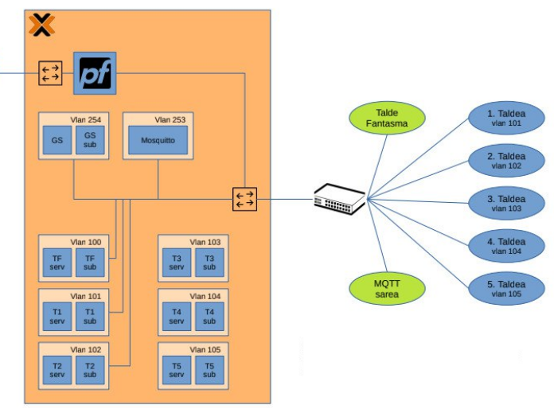
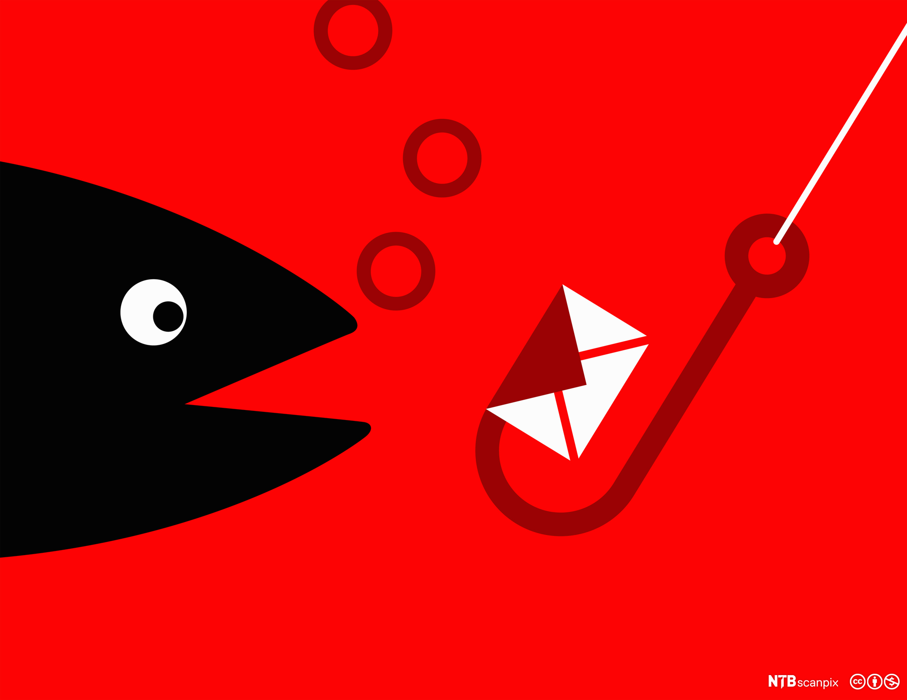
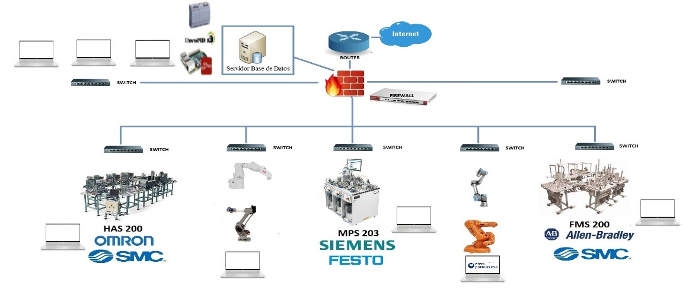

# Cybersecurity 2023-2024
** Memory of the 2023 – 2024 course of the Tknika Cybersecurity Team**

## Aurkibidea

1. [Introduction:](#1presentation)
   - 1.1 [Working Group:](#11-team)
2. [2024 figures:](#22024-figures)
3. [Lines of work:](#3lines-of-work)
      - 3.1 [Projects:](#31projects)
      - 3.1.0 Cyber-Competition
      - 3.1.1 Erd/Def CTF infrastructure:
      - 3.1.2 Erd/Def CTF exercises (Services):
      - 3.1.3 Erd/Def CTF visualization systems:
         - 3.1.3.1 Scoreboard
         - 3.1.3.2 Lighting
- 3.2 [Pilots:](#32-pilots)
   - 3.2.1 Phishing
   - 3.2.2 Vishing
   - 3.2.3 Hack the box
   - 3.2.4 Pentesting
- 3.3 [Courses:](#33courses)
   - 3.3.1 Awareness bells: Phishing-Vishing
   - 3.3.2 Practical workshop to attack unsafe industrial communications
   - 3.3.3 Practical workshop for the segmentation of industrial networks
   - 3.3.4 Secure Web Development
3.3.5 "Cybersecurity regulations from the teacher's point of view." Webinar (Ruth Sala)
   - 3.4 [Centre projects:] (# 34-centre projects)
   - 3.4.1 Cyber car
   - 3.4.2 OT Challenges
4. [Relations and Communication:] (# 4contact and communication)
   - 4.1 [Entrepreneurship Days:] (# 41-entrepreneurship)
---------------------------------------------------------------------------------------------------------------------------------------------
## 1.Presentation:
The contents discussed in the Cybersecurity Working Group** Tknika during the course 2023-24 are shown below. In addition to listing the contents, there are links to the files used or to the materials produced.
### 1.1 Team:
The participants in this course have been:

   - Garikoitz Etxeberria 
   - Paulino Insausti
   - Urko Zuñiga
   - Xabat Zabala
   - Ibai Peña

## 2.2024 Figures:
  
This year we've had 100 students on our Cyber Range. In the survey that we pass them after participating in the session, they say that all students recommend the experience.

## 3.Lines of work:
### 3.1 Projects:
#### 3.1.0 Atk/Def CTF:
  - ##### Context

After the consolidation of the CyberRange last year, this course has begun the launch of a CTF platform that requires, in addition to offensive or investigative capabilities, defensive and gap correction capabilities. The CyberRange has hitherto been the Jeopardy CTF, and this year the aim was to gain the ability to handle and use the attack/defense type.

As platforms of this kind already exist, we first looked at what State-of-the-art was like. In view of the wide variety of opensource options developed, we found it appropriate to rely on them, namely the two developments of the Friedrich-Alexander University Erlangen-Nürnberg University Security Team (FAU). These two developments are used annually in the University's international ER/DEF test.

We have made modifications and additions to these developments to bring them closer to what we needed. The first version of our development can be represented as follows:

This infrastructure has been used in <a href="https://cyberlehia.fpeuskadi.eus/"> Cyberlehia 2024</a> the first cybersecurity competition for Vocational Training in the Basque Country, on the day of the final, to decide the winning team of the tournament.

Here's the summary video of the tournament.

#### 3.1.1 Atk/Def CTF infrastructure:
  - ##### Context

The two projects used by the FAUST Group are:

      - Gameserver: https://github.com/fausecteam/ctf-gameserver
      - Installation process using Ansible: https://github.com/fausecteam/ctf-gameserver-ansible

On the basis of this work, important adaptations have been needed to implement the model we needed, including the addition of the entire substructure of the groups on the platform itself. The result has been the ERD/DEF CTF platform that spreads through Terraform on Proxmox (also under way version of AWS).

#### 3.1.2 Atk/Def CTF exercises (Services):

Once we had the infrastructure available, we created the first tests to test it, and when it was decided that we would then use the infrastructure in the Cyber Competition finals, we created six exercises or services with those originally added to them; here's a little explanation of one of those services, by way of example:
We have a ssh service in place. It is allowed to authenticate by user/password; moreover, a user's password does not maintain minimum recommendations.
Weakening: As far as OWASPE is concerned, we could group it into several groups, but the main one could be considered A07: 2021-Identification and Authentication Failures.
Attack: a vocabulary attack can be carried out using a tool like hydra; if there is no vocabulary, a brutal attack can be directed.
Defense: The possibility of authentication by user/password must be disabled, after which users must be authenticated by asymmetric cryptography using a key.

#### 3.1.3 Atk/Def CTF visualization systems.:

The purpose of the visualization systems is to read the facts that have reached the MQTT broker and to show what is happening through them in an attractive way. Two such developments have been carried out:

##### 3.1.3.1 Scoreboard

   GameServer has a scoreboard, but it provides too much information in a complex way. This new development has sought to obtain a simple and attractive scoreboard that is automatically updated and also provides timely information on the various attacks.
   
   

##### 3.1.3.2 Lightning

   In order to increase visibility, a system of LED lights has been put in place, with 2 lights for each group. The lights will behave differently in the face of different CTF situations. At the beginning and end of the session, all the lights will make a color pattern. When there is an attack, the lights of the attacking group will be green, while those of the attacking group will be red.
   
   

### 3.2 Pilots:
#### 3.2.1 Phishing:
 - ##### Context

In order to work on the Phishing awareness bells, after testing the Smartphense tool last year, a FOSS pilot **Gophish** has been worked on this year. It can be downloaded from Github, from this <a href="https://github.com/gophish/gophish/releases"> link </a>. In the first phase of the awareness bell, the first work has been done at the Tknika facility. To local employees' emails, different emails have been sent from a fake sender with a link to a fake website. After a positive assessment of the work done at Tknika, it was decided to extend this pilot to vocational training centres. After a proposal to different schools, the second phase of the bell was finally discussed at the **Zubiri Manteo IES, Uni Eibar, Izarraitz LH** eta **Iurretako LHI** to local teachers' emails, where different messages were sent.
Click on the following **document** of the steps taken:  

 

Short **video** of the pilot's execution in Tknika:

#### 3.2.2 Vishing:
 - ##### Context
After working on phishing pilots last year and this year, a* VISHING** bell has been made to address the potential impact of this type of attack on the Tknika facility among colleagues. It was an awareness bell made by telephone calls that helped us get to know more closely the techniques and tools that have been used around it.
This campaign, has been requested <a href="https://www.bedisruptive.com/"> BeDisruptive </a> company and in the following document you will find the details of this bell:

 

#### 3.2.3 Hack the box:

 - ##### Context
** The Hack The Box** platform, from the point of view of its use in the Cybersecurity specialty of Vocational Training, has been a tool that has been tested throughout the school year at the FP** Txurdinaga. The different laboratories offered by HTB have been tested and the advantages of working with students have been tested. Plus, this school year, it has been used in <a href="https://cyberlehia.fpeuskadi.eus/es/">**CyberLehia**</a>, and the aim has been to organize a day to share, reflect, and work on the experience and conclusions obtained from it. This day, in addition to sharing the conclusions, has worked together on an HTB challenge.

#### 3.2.4 Pentesting Pilot Iurreta LHI:

 - ##### Context
From the cybersecurity area of Tknika, a Pentest pilot has been launched for the second year in a row. In this pilot, a student specializing in cybersecurity, with the help of a sector company (JakinCode), conducts a security audit of a center (Iurreta LHI).

In order to share the work done at the CEP Iurreta, a Webinar was held in June. Webinar's goal has been to present the results obtained and share the experience with those interested in the process.

### 3.3 Courses:
#### 3.3.1 Kontzientziazio kanpañak: Phishing-Vishing

Tknikan landuriko pilotuen ildoa jarraituz, bertan bilduriko esperientzia partekatu asmoz, ikastaro bat eman da **Phishing/Vishing** tekniken kontzientziazioa landuz. Kontzientziazio kanpañak burutzeko metodologiak eta tresnak landu dira bertan. Kontzientziazio kanpañak burutzeko urratsetan sakondu da: 
 - 1.Informazioa topatu (**OSINT**)
 - 2.Eszenatokiak sortu (**SMTP zerbitzariak, GOPHISH ingurunea**)
 - 3.**Kanpañak** diseinatu.
 - 4.**Vishing** nola?

Ikastaroan erabilitako materiala, Githubek errepositorio honetan duzue ikusgai.
[Dokumentazio Gida](KONTZIENTZIAZIOA)
#### 3.3.2 Komunikazio industrial ez seguruei erasotzeko tailer praktikoa
<a href="https://drive.google.com/drive/folders/1RZYG0BOWVfZFVcp6iwW28reY7XXHdKKw"> Edukiak </a>

Lantegi praktiko honetan, industria-sistemak komunikazio ez-seguruen eta izan dezaketen arriskuen ikuspegitik aztertu dira. Sareko ekipoak ezagutzeko tresnak erabili dira (Nmap), komunikazioetan sortzen den trafikoa aztertu da (Wireshark) eta PLC sistemak "erasotzeko" hainbat teknika erabili dira. 22/23 ikasturtean, industria-kontroleko sistemetan zibersegurtasuna kontuan izateko ikastaroa eman zen. Bertan, sistema industrialak konfiguratzeko orduan zibersegurtasunaren ikuspegitik kontuan hartu beharreko atalak jorratu ziren. Sarrerako prestakuntzaren osagarri gisa, tailer praktiko batzuk planteatu dira, ikastaro horretan ikusitako hainbat atal modu praktikoan lantzeko. Lehen tailerrean industria-komunikazioen gabeziak eta seguruak ez diren industria-sistemetan gerta daitezkeen erasoak aztertu dira.Partaide kopurua: 14 irakasle.

#### 3.3.3 Sare industrialen segmentazio tailer praktikoa
<a href="https://drive.google.com/drive/folders/12DOwM5J-GNARspU_LaM2hmHa2buSFuWq"> Edukiak </a>

Lantegi praktiko honetan sare industrialak segmentatuta izatearen garrantzia aztertuko da. Segmentazio egoki bati esker, ekoizpen-sarean eragina izan dezaketen eta zabaldu ez daitezkeen segurtasun-intzidenteak arindu ditzakegu. Era berean, IEC 62443 segurtasun-araudiak IT/OT sareak bereizita izatera behartzen du. Siemens familiako gailuak, Scalance 615 suhesiak eta Switch 208,408 gailuak erabiliko dira konfigurazioak egiteko. 23/24 ikasturtean, industria-kontroleko sistemetan zibersegurtasuna kontuan izateko ikastaroa eman zen. Bertan, sistema industrialak konfiguratzeko orduan zibersegurtasunaren ikuspegitik kontuan hartu beharreko atalak jorratu ziren. Sarrerako prestakuntzaren osagarri gisa, tailer praktiko batzuk planteatuko dira, ikastaro horretan ikusitako hainbat atal modu praktikoan lantzeko.Partaide kopurua: 16 irakasle.

#### 3.3.4 Web Garapen Segurua

Prestakuntza honen helburua, segurtasuna web garapenaren bizi-zikloaren parte izan dadin, beharrezkoa den ezagutza zabaltzea izan da. Segurtasuna oso espazio zabaleko gaia den arren, prestakuntza honetan web inguruneetan (aplikazioak eta APIak) ematen diren ahulgune ohikoenetan enfokatuko gara. Aipatutako ahulguneak ekiditeko jarraitu beharreko praktika onak ezagutzera eman dira.
Prestakuntza honetan, web-inguruneetan modu seguruan garatzeko kontuan hartu beharreko alderdiak aztertu dira. Horretarako, OWASP erakundeak jasotako ahultasunen top 10ean oinarritu da. OWASP (Open Web Application Security Project) irabazi asmorik gabeko erakunde bat da, eta bere helburua softwarearen segurtasuna hobetzean datza.
“Juice Shop” open source aplikazioa erabili da ikasitakoa praktikan jartzeko. Aplikazio hau segurtasun arazoez beteta dago eta gamifikazio osagai bat du. Ahuleziak ustiatzen diren heinean, lorpenak desblokeatzen dira eta parte-hartzaileak sailkatzen dituen ranking bat sortzen da. Ahuleziak aurkitu ahala, erlazionatutako kodea aztertuko da eta funtzionalitatea modu seguruan garatzeko jarraitu beharreko irizpideak azaltzen dira.

#### 3.3.5 "Zibersegurtasuneko araudia irakaslearen ikuspuntutik". Webinar (Ruth Sala)
Irakaslearen ikuspuntutik Zibersegurtasun Araudiari buruzko webinarra burutu da. Webinar hau <a href="https://www.linkedin.com/in/ruthsala/?originalSubdomain=es">Ruth Sala</a> abokatuak eta gaian adituak eman du, eta bertan zibersegurtasunaren atalean burutzen diren hainbat praktiken legalitatearen inguruan egon daitezkeen galderak erantzun zituen bertan.

Galdera/erantzunak lantzen dituen <a href="docs/Normativa de ciberseguridad desde el punto de vista del docente - Ruth Sala.pdf" class="image fit">dokumentua deskargatu dezakezu HEMEN.</a>
 
###  3.4 Zentruetako proiektuak:
#### 3.4.1 Cyber car
#### 3.4.2 OT Erronkak
## 4.Harremanak eta Komunikazioa:
#### 4.1 Ikasenpresa / Ekintzailetza Jardunaldiak:

Ikasenpresako 3 ekitaldietan hitzaldiak eman ditugu ekintzaile gazteei beraien enpresetan erabil zitzaketen zibersegurtasun aholkuak emateko asmoz. Hona hemen erabilitako aurkezpena.

 

